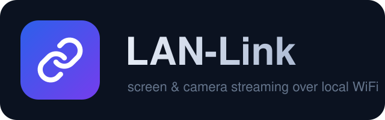

<p align="center">
  
</p>

<h1 align="center">LAN-Link</h1>

<p align="center">
  
  
  
  
</p>

**English** | [العربية](#العربية)

---

LAN-Link turns **your own Android phone + your own PC** into a self-hosted
streaming & remote-control pair. The phone shares its **screen** or its
**front / back camera**, and you watch — and fully control the phone —
from the PC. Everything flows **inside your local WiFi only**: no cloud,
no accounts, no internet dependency.

A small Python script drives everything:

- **Option 1** — builds the Android app for your network and tells you
  exactly where the APK is, ready to install.
- **Option 2** — starts a feature (screen share / front camera / back
  camera) and shows a **QR code**. Scan it with the app (or Google Lens)
  and the connection + streaming starts automatically.

## Features

- **Screen share with full remote control** — watch the phone screen in
  the browser or a desktop window, then tap, swipe, pinch-zoom, press
  Back / Home / Recents and even type text from the PC.
- **Front & back camera streaming** — live camera view at 720p.
- **QR pairing** — one scan connects the phone to the PC; the QR also
  deep-links into the app via Google Lens.
- **Three buttons, nothing more** — screen / front camera / back camera.
- **Dual viewer** — browser page (with on-screen control bar) and a
  native OpenCV window with keyboard/mouse control.
- **Session token** — every session generates a 6-char code; devices
  without it cannot talk to the server.
- **100% LAN** — nothing leaves your router.

## How it works

```
+----------------+  QR (http://pc-ip:port/c?t=token)  +----------------+
|     PC (you)   |----------------------------------->|  Phone camera  |
|  python CLI    |   Google Lens -> lanlink:// deep   |  or LAN-Link   |
|  + server      |   link -> app opens + connects     |  app scanner   |
+-------+--------+                                    +-------+--------+
        |            JPEG frames (WS, binary)                 |
        |  <--------------------------------------------------+
        |            JSON control (tap/swipe/pinch/key/text)  |
        +---------------------------------------------------->|
```

The PC runs the relay server (aiohttp). The phone connects as a WebSocket
client and pushes JPEG frames. Viewers receive the frames and send control
commands back through the Accessibility service (gestures) and the
LAN-Link IME (text). Protocol details: [docs/PROTOCOL.md](docs/PROTOCOL.md).

## Quick start

### 0. Requirements

- PC: Python 3.10+ and the core packages — `pip install -r requirements.txt`
  (for the optional OpenCV desktop window add
  `pip install -r requirements-desktop.txt`)
- Phone: Android 7.0+ (API 24), same WiFi as the PC
- For the automatic APK build: JDK 17+, Gradle and the Android SDK
  (Android Studio bundles all of them) — *or just let GitHub Actions
  build it for you, see below.*

### 1. Build & install the app (script option 1)

```bash
python lanlink.py
# choose 1
# accept the auto-detected IP (or type it)
# -> "THE APP IS READY: .../dist/LAN-Link.apk"
```

Move `dist/LAN-Link.apk` to the phone and install it (allow *Install
unknown apps* for your file manager when asked).

### 2. One-time setup on the phone

1. Open **LAN-Link**.
2. Grant the camera permission (for the camera features).
3. Enable **Settings > Accessibility > LAN-Link Control** -> ON
   *(required for remote tap/swipe/keys)*.
4. Enable **Settings > System > Languages & input > On-screen keyboard >
   LAN-Link Text** -> ON *(required for remote typing; switch the
   keyboard to it when you want to type)*.

### 3. Start streaming (script option 2)

```bash
python lanlink.py
# choose 2
# pick: 1) Screen share  2) Front camera  3) Back camera
# -> a QR code appears in the terminal (also saved as dist/qr-<feature>.png)
# -> scan it with the LAN-Link app (in-app scanner) or Google Lens
# -> the app connects and the stream starts
```

On the PC, pick how to watch:

- **Browser viewer** — opened automatically. Buttons: Screen / Front /
  Back / Stop, plus Back / Home / Recents, Zoom +/- and a text box.
- **Desktop window** — `python lanlink.py window -p 8080 -t <token> -f screen`
  (the exact command is printed by option 2).

### 4. Controls

| PC input                          | Phone action               |
|-----------------------------------|----------------------------|
| Left click on the stream          | Tap                        |
| Left drag                         | Swipe                      |
| `z` / `x` or Zoom +/- buttons     | Pinch zoom in / out        |
| `b` / `h` / `r` or the buttons    | Back / Home / Recents      |
| `t` then type (window) / text box | Type text via LAN-Link IME |
| `1` / `2` / `3` (window)          | Switch screen/front/back   |
| `q` / ESC                         | Close the window           |

## Running on Linux & Termux (Android)

The "PC" side is plain Python — any Linux machine **or another Android
phone running Termux** can act as the server/viewer:

**Linux**
```bash
pip install -r requirements.txt            # core: server + QR
pip install -r requirements-desktop.txt    # optional: OpenCV desktop window
python3 lanlink.py
```

**Termux (a second Android phone as the "PC")**
```bash
pkg update && pkg install python git
pip install -r requirements.txt      # aiohttp + qrcode only — Termux-safe
python lanlink.py                    # option 2 -> QR -> stream
```

Notes for Termux:

- Skip `opencv-python` — open the **browser viewer** instead
  (`http://<termux-ip>:8080/?t=<code>` from any browser on any device).
- Get the Termux IP with `ifconfig wlan0` (or `pkg install net-tools`).
- Phone-to-phone works: phone A runs Termux + browser viewer, phone B
  runs the LAN-Link app. Same WiFi required.
- If pip fails to build a wheel: `pkg install build-essential` then retry.

## Building the APK — 3 ways

| Way | When | How |
|-----|------|-----|
| Automatic (`python lanlink.py` -> 1) | JDK 17 + Gradle + Android SDK are installed | The script writes `assets/lanlink.properties` and runs `gradle :app:assembleDebug`, copying the APK to `dist/` |
| Android Studio | Daily development | Open the `android/` folder, *Build > Build APK(s)* |
| GitHub Actions | Nothing installed locally | Activate the build workflow once (below), then every push uploads the APK as an artifact |

### Enable the GitHub Actions APK builder (one-time, 30 seconds)

The workflow ships as a plain text file so you can add it from the
GitHub website without any special token:

1. Open `docs/android-build-workflow.yml.txt` in this repo and copy its content.
2. On GitHub: **Add file > Create new file** -> name it
   `.github/workflows/android-build.yml`
3. Paste the content, commit — done. The **Actions** tab will now build
   the APK on every push (download it from the run's *Artifacts*).

## Security & responsible use

- **Use LAN-Link only on devices you own, or with the owner's explicit
  consent.** The app cannot be installed silently — every capture needs
  an explicit on-device permission (MediaProjection consent dialog,
  camera permission) and remote control needs Accessibility + IME to be
  enabled manually in system settings. That is by design.
- The session token gates every endpoint; a new token is generated each
  time option 2 runs. Only devices that scanned the current QR can
  connect.
- Traffic is plain HTTP/WS on your LAN — do not expose the port to the
  internet (no port forwarding).

## Troubleshooting

- **App can't connect** — PC firewall blocking Python/port 8080? Allow
  it, and confirm both devices are on the same WiFi (guest WiFi often
  isolates clients).
- **"screen-consent-needed"** — to stream the *screen*, start the screen
  share from the phone app (or a QR with `f=screen`) so the system
  consent dialog can appear. Camera feeds can be switched live from the
  viewer.
- **Remote tap not working** — enable *LAN-Link Control* in Accessibility
  settings.
- **Remote typing not working** — enable *LAN-Link Text* keyboard and
  switch to it on the phone.
- **Low fps** — both sides default to 720p JPEG @ ~10 fps; a strong 5GHz
  WiFi helps a lot.

## Roadmap

- [ ] H.264 hardware encoding (MediaCodec)
- [ ] Audio streaming
- [ ] File push/pull + clipboard sync
- [ ] WSS + PIN pairing
- [ ] Package the Python side as an importable `lanlink` library

## License

[MIT](LICENSE) — use it, fork it, build your own library on top of it.

---

<a id="العربية"></a>
## العربية

**LAN-Link** بيحوّل **موبايلك الأندرويد + الكمبيوتر بتاعك** لزوج بث وتحكم
شغّال على شبكتك المحلية: الموبايل يبعت شاشته أو الكاميرا الأمامية/الخلفية،
وانت تتفرج — وتتحكم في الموبايل بالكامل — من الكمبيوتر. كل حاجة جوه
الواي فاي بس: **بدون كلود، بدون حسابات، بدون إنترنت**.

سكريبت بايثون واحد بيتحكم في كل حاجة:

- **الخيار 1** — يجهز التطبيق على شبكتك ويبني الـ APK ويقولك مكانه بالظبط
  عشان تثبته عادي على الموبايل وتديله الصلاحيات.
- **الخيار 2** — يشغّل الميزة (مشاركة شاشة / كاميرا أمامية / كاميرا خلفية)
  ويطلعلك **QR كود**. امسحه بالتطبيق (ماسح مدمج) أو بجوجل lens — اللينك
  بيفتح التطبيق أوتوماتيك ويعمل الاتصال ويبدأ البث.

### الخطوات باختصار

1. `pip install -r requirements.txt`
2. `python lanlink.py` → خيار **1** → يطلعلك APK في مجلد `dist/`
3. ثبّت الـ APK على الموبايل وافتحه وادّيله الصلاحيات:
   - إعدادات > **الوصولية (Accessibility)** > LAN-Link Control → ON
     *(للتحكم عن بعد: لمس/سحب/أزرار)*
   - إعدادات > **اللغة والإدخال** > لوحات المفاتيح > LAN-Link Text → ON
     *(لكتابة النصوص عن بعد)*
4. `python lanlink.py` → خيار **2** → اختار الميزة → امسح الـ QR
5. اتفرج من المتصفح أو نافذة سطح المكتب، وتحكم: كليك = لمسة، سحب = سوايب،
   `z/x` = زووم، `b/h/r` = رجوع/هوم/المتاحة، `t` = اكتب نص.

### تفعيل بيلد الـ APK أوتوماتيك من GitHub (مرة واحدة، 30 ثانية)

1. افتح ملف `docs/android-build-workflow.yml.txt` في الريبو وانقل محتواه.
2. على GitHub: **Add file > Create new file** → سمّيه
   `.github/workflows/android-build.yml`
3. الصق المحتوى واعمل commit — خلاص. من تاب **Actions** هتلاقي الـ APK
   جاهز للتحميل مع كل رفع جديد (من Artifacts).

### استخدام مسؤول

استخدم الأداة **على أجهزتك أنت فقط أو بإذن صريح من صاحبها**. التطبيق
مصمم بحيث كل صلاحية تتطلب موافقة ظاهرة على شاشة الموبايل — مفيش تثبيت
خفي ولا تشغيل متخفي، وده عن قصد.

### على لينكس / تيرمكس (موبايل تاني يشتغل بدور "الكمبيوتر")

الجزء اللي على الكمبيوتر بايثون خالص — يشتغل على أي لينكس **أو حتى
موبايل أندرويد تاني عليه تطبيق تيرمكس**:

```bash
# لينكس:
pip install -r requirements.txt            # الأساسيات: السيرفر + QR
pip install -r requirements-desktop.txt    # اختياري: نافذة سطح المكتب (OpenCV)
python3 lanlink.py

# تيرمكس (موبايل تاني):
pkg update && pkg install python git
pip install -r requirements.txt      # aiohttp + qrcode فقط — آمنة على تيرمكس
python lanlink.py
```

- على تيرمكس سيب `opencv` وشيلك — افتح **عارض المتصفح** بدال النافذة:
  `http://<ip-تيرمكس>:8080/?t=<الكود>` من أي متصفح على أي جهاز.
- اطلع IP تيرمكس بأمر `ifconfig wlan0`.
- تقدر تعمل موبايل-لموبايل: موبايل A عليه تيرمكس + المتصفح، وموبايل B
  عليه تطبيق LAN-Link — بشرط نفس شبكة الواي فاي.

### الأمان

- كل الطلبات محمية بكود جلسة (6 حروف) بيتولد مع كل تشغيل للخيار 2.
- حافظ على البورت داخل الشبكة المحلية — لا تعمل port forwarding.
